# figurefeed-ai

Developed by ViniciusARZ ([varzdecisions.com](https://www.varzdecisions.com)) - Used in [instagram.com/varz_collection](https://www.instagram.com/varz_collection/)

**AI-powered pipeline for posting anime figure photos to Instagram using Google Photos, Imgur, and the Instagram Graph API.**  
The system automatically identifies figures and generates captions (via AI), then publishes them through a fully automated workflow.

```mermaid
flowchart LR
    A[Start Workflow] --> B[Fetch photos from Google Photos]
    B --> C[Check if photo already posted]
    C -- New --> D[Download image bytes]
    D --> E[Identify figure with OpenAI models]
    E --> F[Generate caption with CrewAI]
    F --> G[Upload image to Imgur]
    G --> H[Post to Instagram via Graph API]
    H --> J[Delete from Imgur]
```




---

## Features

- Fetches images from a specified Google Photos album
- Identifies anime figures and generates captions using AI (OpenAI models)
- Uploads images to Imgur for temporary hosting
- Publishes posts to Instagram via the Instagram Graph API
- Fully automated, end-to-end workflow

---

## Requirements

- Instagram **Business** account
- Linked **Facebook Page**
- **Meta App** created via the [Facebook Developer Portal](https://developers.facebook.com/)
- **Long-lived access token** with required permissions
- **Imgur API client ID** (for image hosting)
- **Google Cloud project** with Google Photos Library API enabled
- Google Photos album containing the images to post
- Python 3.12

---

## 🛠 Installation

### Fork the Repository

#### Using GitHub CLI  
If you have the GitHub CLI (https://cli.github.com/) installed, you can fork and clone it:

``` bash
    gh repo fork ViniciusARZ/figurefeed-ai --clone
    cd figurefeed-ai
```

#### Using the Web Interface  
1. Navigate to [figurefeed-ai](https://github.com/ViniciusARZ/figurefeed-ai)
2. Click the **Fork** button in the top-right corner
3. After forking, clone your repository:

``` bash
    git clone https://github.com/<your-github-username>/figurefeed-ai.git
    cd figurefeed-ai
```

---

### 2. Install Dependencies

This project uses [Poetry](https://python-poetry.org/) for dependency management, make sure to install the version 2.0 or higher.

If Poetry is not installed:
```bash
    pip install poetry
```
Then install all project dependencies:
```bash
    poetry install
```
---

## Usage

To run the automated workflow and post images use:

```bash
poetry run python post_figurefeed.py
```

---

## Setup

### 1. Instagram Business Setup

1. Convert your Instagram account to a **Business** account  
   - Instagram → **Settings → Account → Switch to Professional Account**
   - Choose **Business** (not Creator)
2. Link it to a **Facebook Page**

---

### 2. Create a Meta App & Token

1. Go to [developers.facebook.com/apps](https://developers.facebook.com/apps)
2. Create a new app with type **"Business"** or **"Other"**
3. Add the **Instagram Graph API** product to the app
4. Go to [Graph API Explorer](https://developers.facebook.com/tools/explorer/)
   - Select your app
   - Generate a **short-lived token** with these permissions:
     - `instagram_basic`
     - `pages_show_list`
     - `pages_read_engagement`
     - `instagram_content_publish`
     - `business_management`
5. Exchange it for a **long-lived token** (see helper script in `meta_helpers/meta_long_lived_token.py`)

---

### 3. Configure `config.json`

Create a file at the root of your project named `config.json` with the following fields:

```json
{
  "google_photos_album_id": "your-album-id",
  "openai_api_key": "your-openai-api-key",
  "meta_access_token": "your-long-lived-token",
  "meta_ig_user_id": "your-instagram-user-id",
  "imgur_client_id": "your-imgur-client-id"
}
```

- `google_photos_album_id`: ID of the album to pull images from (use [`google_photos_client/check_folder_ids.py`](google_photos_client/check_folder_ids.py) to find it)
- `openai_api_key`: Used for figure identification and caption generation
- `meta_access_token`: Long-lived token from your Meta App
- `meta_ig_user_id`: Instagram Business account ID from Meta Graph API
- `imgur_client_id`: Used to temporarily host images before publishing

---


